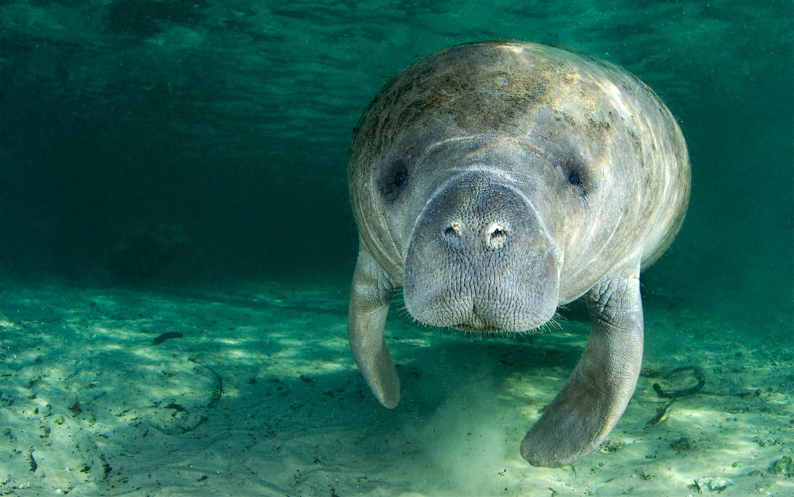

## Manatee Conservation

### The conservation status of the West Indian Manatee in Florida was downgraded from __endangered__ to __threatened__ in 2017 due to their population increase. 

#### Recent reports indicate that manatee mortality is going to reach a record high in 2019, possibly due to human activity (more boat purchases, more waterfront purchases, and more activity in general). Because manatees are my favorite animal, I'm interested in learning more about the rise and fall of their population, possible correlations, and ultimately - how we can learn to live peaceably together.  

